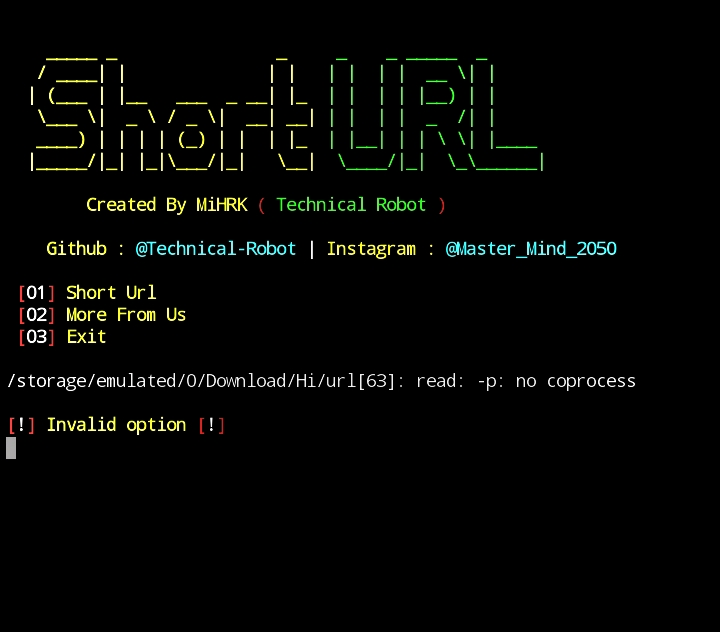

# Short Url
### [+] Created By MiHRK (@Technical_Robot)
### [+] Disclaimer :
***Short Url is a tool to short url.This tool uses [TinyURL](https://tinyurl.com/)'s Api. It is created for Educational Purpose only.***

<h1 align="center">  </h1>

### [+] Installation
```apt update```

```apt install git -y```

```git clone https://github.com/Technical-Robot/Short-URL```

```cd Short-URL```

```bash setup.sh```

## Type `shorturl` or `ShortUrl` to run the Tool.
### Or, Use Single Command
```
apt update && apt install git -y && git clone https://github.com/Technical-Robot/Short-URL && cd Short-URL && bash setup.sh && Short-URL
```
## [+] Find Me on :

[](https://github.com/Technical_Robot)
